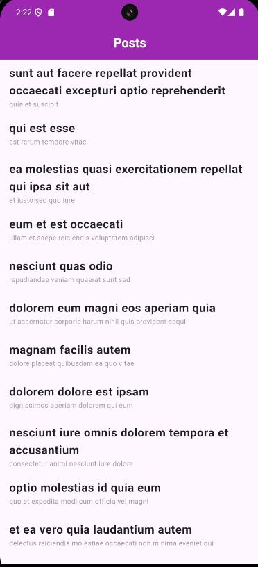

# 🛒 Flutter GreenGrocer App
Este é um aplicativo simples desenvolvido em Flutter que exibe uma lista de posts de uma API pública. Ao clicar em um item da lista, uma nova tela é aberta mostrando os detalhes do post selecionado.
## 📱 Funcionalidades
* Listagem de posts a partir de uma API pública.
* Exibição dos detalhes do post em uma tela separada ao clicar em um item da lista.
## 🚀 Tecnologias
Este projeto foi desenvolvido com as seguintes tecnologias:

* Flutter: SDK para desenvolvimento de aplicativos multiplataforma.
* Dart: Linguagem de programação usada no Flutter.
* HTTP: Dependência usada para realizar requisições à API.

##  📦 Estrutura do Projeto
O projeto está estruturado em arquivos principais para facilitar a organização:

* main.dart: Ponto de entrada do aplicativo, inicializando a HomePage.
* home_page.dart: Tela principal do app que exibe a lista de posts.
* api_service.dart: Serviço responsável por realizar a requisição HTTP à API.
* post.dart: Modelo de dados para representar os posts.
* post_detail_page.dart: Tela de detalhes que exibe o título e o corpo do post selecionado.

## 📡 API
Este aplicativo utiliza a seguinte API pública para obter dados dos posts:

<a href="https://jsonplaceholder.typicode.com/posts">https://jsonplaceholder.typicode.com/posts</a>

##  📲 Como Funciona
*  Tela Inicial: Ao abrir o aplicativo, é feita uma requisição à API e uma lista de posts é exibida em um ListView.
** Navegação para Detalhes: Ao tocar em um item da lista, o usuário é levado a uma tela de detalhes (PostDetailPage), que exibe o título e o corpo do post selecionado.

## 📸 Capturas de Tela

### Tela Home e Tela Detalhe

  
  

